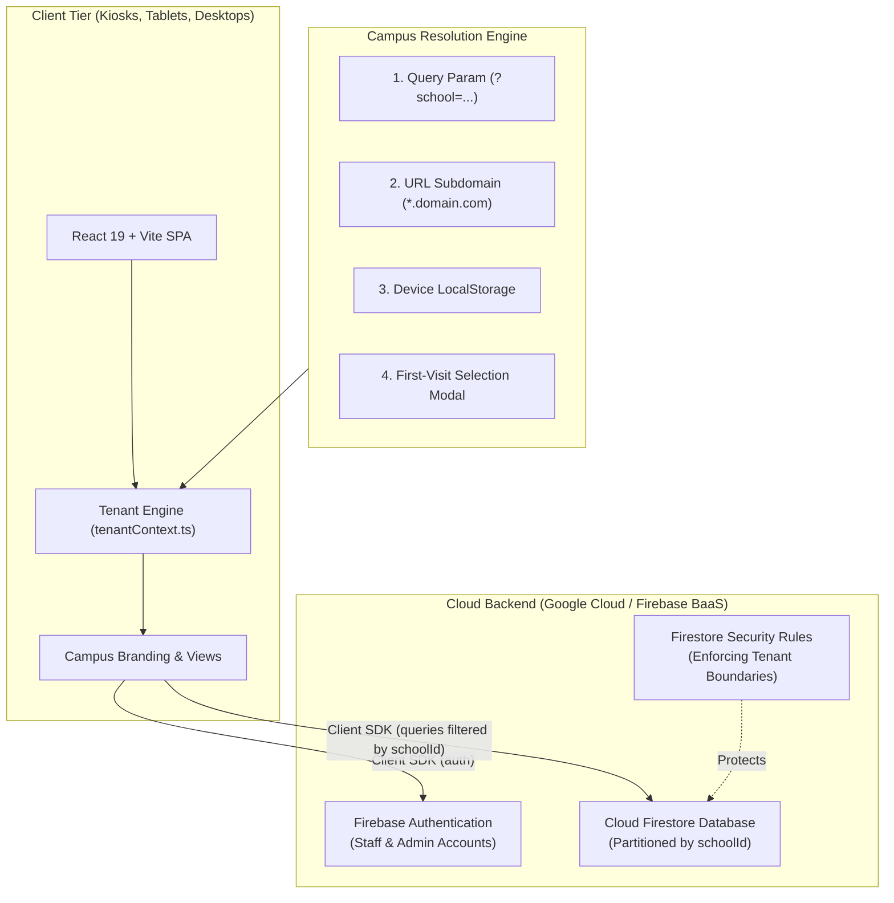
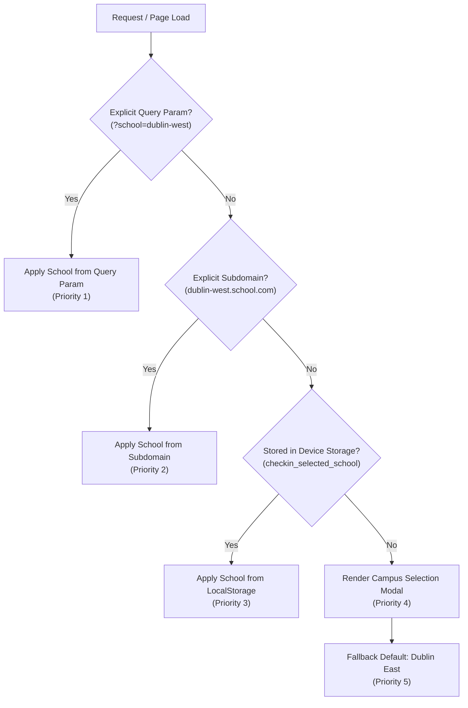
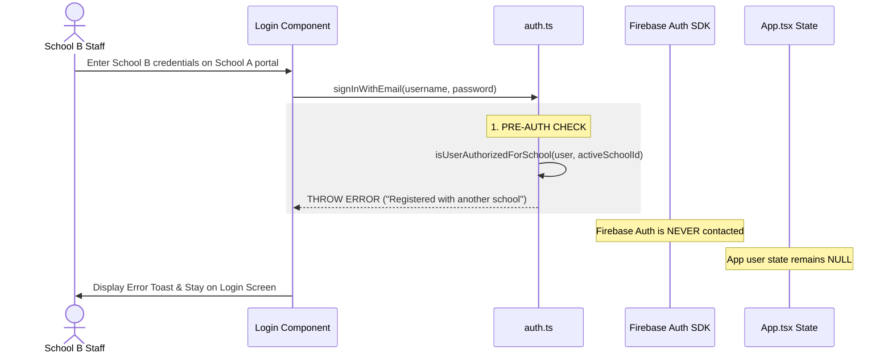

# Multi-School Architecture & Implementation Overview
### High-Level Engineering Guide: Multi-Tenant Kumon Check-In System

This document provides a high-level overview of how the multi-school / multi-tenant architecture was engineered and deployed on the `feature/subdomain-per-school` branch. It explains the system architecture, database partitioning, campus resolution, authentication guardrails, and bare-domain persistence for platforms like Render.

---

## 1. Executive Summary & Goal

### The Problem
Originally, the Kumon Check-In system was designed as a single-school application for **Dublin - East**. As operations expanded to a second campus (**Dublin - West**), the system required:
1. **Zero Data Leakage**: Students, attendance logs, authorized guardians, and staff from Dublin East must never be visible to or accessible by Dublin West (and vice-versa).
2. **Unified Codebase & Database**: Maintaining separate codebases or duplicate cloud projects introduces deployment drift and high maintenance overhead. A single unified deployment and database was required.
3. **Preservation of Real Data**: All existing production records (113 real students, 106 attendance history entries, 212 pickups) belong to Dublin East and had to be preserved with 100% integrity.
4. **Flexible Hosting (Render & Custom Domains)**: Support both dedicated subdomains (e.g. `dublin-east.schoolapp.com`) and shared bare domains (e.g. Render's `check-in-system.onrender.com`).

### The Solution: Option 2 (Subdomain-Per-School with BaaS)
We implemented a **tenant-scoped, subdomain-routed architecture**:
- **Single Firestore database** partitioned by a `schoolId` foreign key on every collection.
- **Client-side routing & context engine** (`tenantContext.ts`) that determines the active campus from subdomains, query parameters, or remembered device storage.
- **Automated first-time visit selection & remembering** for platforms without custom subdomains (like Render).
- **Strict multi-layered authentication boundaries** preventing cross-school logins.

---

## 2. High-Level Architecture

The application is a **pure frontend Single Page Application (SPA)** utilizing Firebase as a **Backend-as-a-Service (BaaS)**. There is no intermediate Node.js or Express API server to maintain or scale.



---

## 3. Database Migration & Real Data Isolation

### Safe Cloud Firestore Migration
To transition the live production database without data loss, we authored and executed an idempotent migration script ([`scripts/migrate_multi_school_firestore.ts`](file:///home/Code/DBT/check-in-system/02-checkin-out/scripts/migrate_multi_school_firestore.ts)):

1. **Tagging Real Records (Dublin East)**:
   - Scanned all documents in `students`, `attendance`, `authorized_pickups`, and `users`.
   - Idempotently stamped any unassigned record with `schoolId: 'school_dublin_east'`.
   - Preserved all 113 real student profiles, phone numbers, and check-in history without modification.

2. **Provisioning Demo Data (Dublin West)**:
   - Provisioned 8 demo students (`20001` - `20008`), 12 authorized guardians, and sample attendance history tagged with `schoolId: 'school_dublin_west'`.
   - Provisioned Dublin West staff accounts (`Sanjay` as Admin, `WestStaff` as Staff).

3. **Migration Audit Results**:
   | Collection | Pre-Migration Count | Dublin East (Real) | Dublin West (Demo) | Untagged Remaining |
   | :--- | :--- | :--- | :--- | :--- |
   | **`students`** | 113 | **113** | **8** | **0** |
   | **`attendance`** | 106 | **106** | **3** | **0** |
   | **`authorized_pickups`** | 212 | **212** | **12** | **0** |
   | **`users`** | 6 | **4** | **3** | **0** |

4. **Automatic Record Stamping**:
   - Any new record created in the system (a new student registration, check-in log, or pickup authorization) is automatically stamped with the active school's ID:
     ```ts
     const activeSchoolId = getActiveSchoolId();
     const studentWithTenant = { ...student, schoolId: activeSchoolId };
     await db.saveStudent(studentWithTenant);
     ```

---

## 4. Campus Resolution & Routing Engine

The engine in [`src/lib/tenantContext.ts`](file:///home/Code/DBT/check-in-system/02-checkin-out/src/lib/tenantContext.ts) resolves the active campus using a strict 5-stage priority ladder:



### Precedence Hierarchy:
1. **Explicit Query Parameter** (`?school=dublin-west` or `?subdomain=dublin-east`): Highest priority. Allows direct links, QR codes, and local testing.
2. **Explicit Hostname Subdomain** (`dublin-east.schoolcheckin.com` or `dublin-east.localhost:3000`): Used when domain DNS routes subdomains.
3. **Device LocalStorage Memory** (`checkin_selected_school`): The remembered selection on this physical device/tablet.
4. **First-Time Visit Selection Prompt** (`CampusSelectionModal.tsx`): Displayed if no explicit school is indicated and none has been remembered yet.
5. **Default Fallback** (`school_dublin_east`): Failsafe fallback ensuring the application always loads.

---

## 5. Render & Bare Domain Support (The First-Visit Experience)

### Why This Was Required
When deploying on free/standard cloud platforms like Render, the app is assigned a single shared domain (e.g. `check-in-system.onrender.com`). Render does not provide wildcard subdomains on `.onrender.com`.

### How We Solved It
1. **Non-Dismissible First-Visit Modal ([`CampusSelectionModal.tsx`](file:///home/Code/DBT/check-in-system/02-checkin-out/src/components/CampusSelectionModal.tsx))**:
   - If a tablet or browser opens `https://check-in-system.onrender.com` without a pre-existing selection, a campus selection dialog appears before sign-in.
   - Shows interactive campus cards for **Dublin East** (Cyan theme) and **Dublin West** (Emerald theme) with addresses, phone numbers, and branding.
   - Once tapped, the choice is saved to the browser's `localStorage`.

2. **Persistent Recognition**:
   - When the kiosk or browser is reopened or refreshed tomorrow, the device immediately loads the selected center without re-prompting.

3. **Login Screen Campus Switcher ([`Login.tsx`](file:///home/Code/DBT/check-in-system/02-checkin-out/src/components/Login.tsx))**:
   - On bare domains, a campus badge is shown at the bottom of the sign-in box:
     ```text
     Campus: Dublin - East (Change)
     ```
   - Staff can tap **`(Change)`** at any time to switch campuses without clearing browser cookies or caches.
   - On explicit subdomains (`dublin-east.domain.com`), this switcher is automatically hidden to prevent staff from accidentally breaking the subdomain URL contract.

---

## 6. Authentication & Cross-Campus Security Boundaries

### The Challenge: Cross-Campus Credential Redirection
In multi-tenant systems, entering valid credentials belonging to School B while on School A's portal must not log the user in, leak data, or redirect to the dashboard.

### Defense-in-Depth Implementation



1. **Pre-Authentication Block ([`src/lib/auth.ts`](file:///home/Code/DBT/check-in-system/02-checkin-out/src/lib/auth.ts))**:
   - Before `signInWithEmailAndPassword` is called, the system matches the account's registered `schoolId` against `getActiveSchoolId()`.
   - If the account belongs to another campus, the attempt is aborted **before Firebase Auth is touched**.
   - This eliminates race conditions where Firebase's `onAuthStateChanged` fires and triggers a dashboard redirect before the client-side check finishes.

2. **Reactive Listener Guard ([`src/lib/auth.ts`](file:///home/Code/DBT/check-in-system/02-checkin-out/src/lib/auth.ts) & [`src/App.tsx`](file:///home/Code/DBT/check-in-system/02-checkin-out/src/App.tsx))**:
   - Even if an existing session token is restored, `subscribeToAuthState` verifies `isUserAuthorizedForSchool(appUser, activeSchoolId)`.
   - If a mismatch is detected, it immediately executes `signOut(auth)`, purges `localStorage`, and passes `null` to `App.tsx`.

3. **Active Session Flushing on Campus Switch ([`src/App.tsx`](file:///home/Code/DBT/check-in-system/02-checkin-out/src/App.tsx))**:
   - When a device changes campuses via the switcher or URL, any active session from the previous campus is automatically signed out and cleared from memory.

4. **Role Hierarchy**:
   - **`staff` & `admin`**: Strictly scoped to their single registered `schoolId`.
   - **`super_admin`**: Central multi-school administrator with authorized access across all campuses.

---

## 7. Dynamic Branding & Theming

Every campus has dedicated brand styling configured in `SEED_SCHOOLS` ([`src/lib/tenantContext.ts`](file:///home/Code/DBT/check-in-system/02-checkin-out/src/lib/tenantContext.ts)):

| Attribute | Kumon of Dublin - East | Kumon of Dublin - West |
| :--- | :--- | :--- |
| **School ID** | `school_dublin_east` | `school_dublin_west` |
| **Slug** | `dublin-east` | `dublin-west` |
| **Theme Color** | Cyan (`#2edaff`) | Emerald (`#10b981`) |
| **Subtitle** | Dublin - East | Dublin - West |
| **Address** | 7111 Village Pkwy, Dublin, CA 94568 | 4280 Dublin Blvd, Dublin, CA 94568 |
| **Admin Account** | `Ajita` | `Sanjay` |
| **Staff Account** | `CenterStaff` | `WestStaff` |

The `useSchoolBranding()` hook dynamically supplies these properties to the navigation header, logos, backgrounds, and badges, giving each campus a distinct visual identity.

---

## 8. Verification & Quality Assurance

The implementation is verified by an automated test suite ([`src/tests/tenant-isolation-option2.test.ts`](file:///home/Code/DBT/check-in-system/02-checkin-out/src/tests/tenant-isolation-option2.test.ts)):

```text
✓ src/tests/tenant-isolation-option2.test.ts (15 tests)
  ✓ Option 2: Separate Subdomain / Dashboard Per School (15)
    ✓ Subdomain Parsing & Resolution (3 tests)
      ✓ correctly extracts slug from localhost subdomain URLs
      ✓ supports query parameter overrides for local development convenience
      ✓ resolves correct school metadata from parsed subdomain
    ✓ Subdomain Data Isolation (4 tests)
      ✓ guarantees requests to dublin-east subdomain only return dublin-east students
      ✓ guarantees requests to dublin-west subdomain only return dublin-west students
      ✓ isolates attendance records by subdomain
      ✓ automatically stamps newly created records with the active subdomain schoolId
    ✓ Subdomain Login Scoping & Branding (3 tests)
      ✓ scopes staff login boundary: School B user cannot authenticate into School A subdomain
      ✓ rejects signInWithEmail attempt when staff credentials belong to another school
      ✓ provides distinct branding hooks per subdomain (theme color and subtitle)
    ✓ First-Time Visit Campus Selection & Remembering (Bare Domain / Render) (5 tests)
      ✓ requires campus selection on bare domain when no school is remembered
      ✓ does not require selection when explicit subdomain or query param is provided
      ✓ persists selected campus and steers subsequent requests on bare domain
      ✓ prioritizes explicit subdomains and query params over remembered selection
      ✓ allows clearing or changing remembered school
```

- **TypeScript Linting**: `npm run lint` (`tsc --noEmit`) passes with **0 errors**.
- **Production Build**: `npm run build` (`vite build`) successfully produces production-ready bundles in `dist/`.

---

## 9. How to Run & Deploy

### Running Locally
```bash
npm run dev
```

1. **Dublin East Portal (Real Students)**:
   - URL: `http://localhost:3000/?school=dublin-east` (or `http://dublin-east.localhost:3000`)
   - Credentials: `Ajita` | `Oh43016` (or `CenterStaff` | `Oh43017`)
2. **Dublin West Portal (Demo Students)**:
   - URL: `http://localhost:3000/?school=dublin-west` (or `http://dublin-west.localhost:3000`)
   - Credentials: `Sanjay` | `Oh43016` (or `WestStaff` | `Oh43017`)
3. **Bare Domain / Render Simulation**:
   - URL: `http://localhost:3000/` (opens first-visit selection modal)

### Deploying to Render
1. Create a new **Static Site** on Render.
2. Connect this repository and set the branch to `feature/subdomain-per-school`.
3. Set the build settings:
   - **Build Command**: `npm run build`
   - **Publish Directory**: `dist`
4. Set the SPA rewrite rule:
   - **Source**: `/*`
   - **Destination**: `/index.html`
   - **Action**: `Rewrite`
