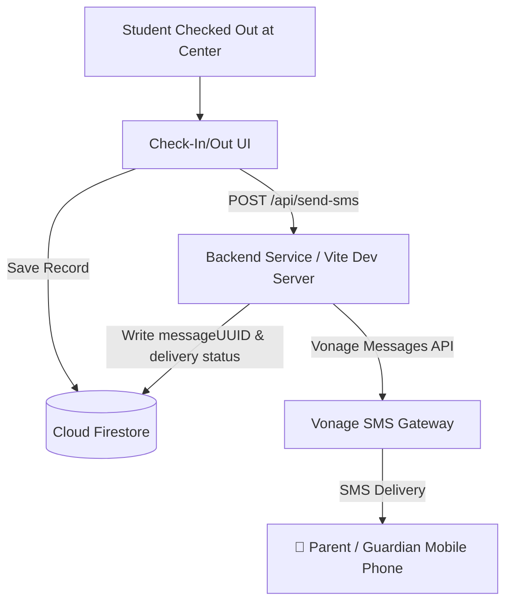

# Vonage SMS Service Integration Guide

## 1. Executive Summary

This document explains how the **Vonage Messages API** is integrated into the Kumon Student Check-In System to provide automated, real-time SMS notifications to parents and guardians.

### Purpose
To ensure student safety, operational transparency, and parent peace of mind by instantly notifying parents the exact moment their child is checked out from the center, along with the designated authorized pickup person.

---

## 2. Trigger Condition (When Is SMS Sent?)

> **Rule**: An SMS is dispatched **strictly and only upon student check-out**. No SMS is sent on student check-in or administrative data browsing.

SMS dispatch occurs in two operational workflows:
1. **Staff Terminal (`CheckInOut.tsx`)**: When a staff member selects the authorized pickup person and confirms student check-out.
2. **Student Self-Service Kiosk (`StudentDashboard.tsx`)**: When a student requests check-out and a staff member enters their security authorization PIN.

---

## 3. SMS Message Content & Format

Every check-out generates a concise, automated text message:

```text
[Student Full Name] was checked out from Kumon at [Time]. Picked up by [Authorized Person].
```

### Real-World Example:
> *"Adam Smith was checked out from Kumon at 4:15 PM. Picked up by John Smith."*

---

## 4. Recipient Phone Resolution Logic

Before dispatching the SMS, the system resolves the recipient phone number based on student records:

| Scenario | Recipient Selected | Description |
| :--- | :--- | :--- |
| **Default** | Primary Parent Contact | Sent to `student.parent.phone` on file. |
| **Secondary Contact** | Secondary Parent / Guardian | Sent to `student.parent.phone2` (if registered). |
| **Both Contacts** | Multi-recipient Dispatch | Sends individual SMS messages to **both** phone numbers simultaneously. |
| **Custom / Alternate** | Specified Authorized Phone | Staff enters a verified phone number for that specific pickup. |

All phone numbers are automatically cleaned and formatted into international **E.164 format** before calling the Vonage API.

---

## 5. System Architecture & Data Flow



---

## 6. Vonage API Details

### API & Libraries
- **API**: [Vonage Messages API (SMS Channel)](https://developer.vonage.com/en/messages/overview)
- **Node.js SDK**: `@vonage/server-sdk` (`v3.x`) and `@vonage/messages` (`v1.x`)

### Authentication & Configuration
The integration uses standard environment variables:

```env
VONAGE_API_KEY="0b9785a2"
VONAGE_API_SECRET="YOUR_VONAGE_API_SECRET"
VONAGE_FROM="Vonage APIs"
```

### Code Implementation Snippet (`send-sms.js`)
```javascript
import { Vonage } from '@vonage/server-sdk';
import { Channels } from '@vonage/messages';

const vonage = new Vonage({
  apiKey: process.env.VONAGE_API_KEY,
  apiSecret: process.env.VONAGE_API_SECRET,
});

export async function sendSMS({ to, text, from = 'Vonage APIs' }) {
  return await vonage.messages.send({
    messageType: 'text',
    channel: Channels.SMS,
    text: text,
    to: to,
    from: from,
  });
}
```

---

## 7. Audit Trail & Delivery Tracking

For auditability, every checkout record in the database tracks:
- `smsNotificationSent`: `true` / `false`
- `smsRecipientPhone`: Masked/verified destination phone number
- `smsSentAt`: Exact ISO timestamp of SMS dispatch
- `smsStatus`: `sent`, `failed`, or `queued`

---

## 8. Volume & Cost Justification for Subscription

- **Usage Estimate**: 1 SMS per student check-out per center session.
- **Estimated Volume**: `(Number of active students) × (Average sessions per month)`.
- **Value**:
  - Eliminates manual parent calls/texts by staff.
  - Provides a timestamped digital audit trail of student departures.
  - Increases parent trust and satisfaction with instant departure alerts.
